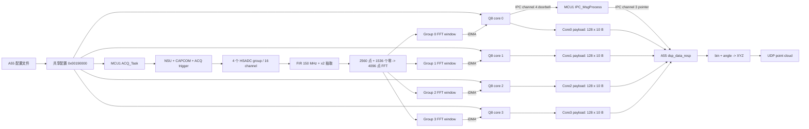

# MCU1 ADC 配置与 Q8 数据处理完整说明

文档共约 1300 行、25 个章节，按照实际数据流逐步说明了以下内容：

- A55 如何读取配置、分配四个 Q8 payload buffer，并把共享配置发布到 0x00190000。
- A55、Q8、MCU1 对同一块共享 SRAM 的地址视图差异。
- MCU1 的启动、MPU、D-cache、FreeRTOS、日志任务和 ACQ_Task 执行顺序。
- 四组 HSADC、每组四通道的配置过程。
- 1.25 GHz ADC 模式的 HSAFE 复位、时钟、校准和 offset 配置。
- 5120 个原始采样点如何经过：

  32-tap 150 MHz FIR
    -> decimation x2
    -> 2560 个有效点
    -> 补 1536 个零
    -> 4096 点硬件 FFT

- CAP_SIZE=0x9F、FFT_SIZE=6、FFT_RD_PERIOD=0x2FB 等寄存器参数的计算依据。
- NSU、CAPCOM、ACQ trigger counter、HSADC、TX serializer 之间的完整触发关系。
- 当前内部触发模式，以及 GPIO 61、GPIO 48 在现有代码中的实际用途。
- ADC/FFT 完成后，如何通过 TrigIn_iDMA 和 TrigOut_iDMA 与 Q8 握手。
- 供应商勘误后的 ADC/FFT buffer 地址：

  Q8 core0: RAW 0x00620000，FFT 0x00630000
  Q8 core1: RAW 0x00720000，FFT 0x00730000
  Q8 core2: RAW 0x00820000，FFT 0x00830000
  Q8 core3: RAW 0x00920000，FFT 0x00930000

- Q8 SRAM、DRAM0 ping、DRAM0 pong、工作区和 DRAM1 的链接布局及用途。
- 四路 iDMA channel、两个 ping/pong descriptor、descriptor flag 和中断注册过程。
- idma_register_interrupts()、xthal_enable_interrupts()、XT_WAITI() 的职责。
- 当前 v5 单在途 descriptor 方案的逐步运行时序，以及为什么仍需要板端长期验证。
- 每通道 8192 字节 FFT 数据的格式：

  2048 complex FP16 bins
  = 2048 × real/imag × 2 bytes
  = 8192 bytes

- Q8 如何计算 real² + imag²、搜索最大 bin，并输出每通道一个峰值索引。
- 每核 10 字节记录、128 条记录、四核共 5120 字节的 payload 协议。
- 水平角 -6000..6000 对应 -60.00°..+60.00° 的生成过程。
- Q8 core0 如何通过 IPC channel 4 通知 MCU1。
- MCU1 如何组合四个 Q8 buffer 地址，通过 channel 3 通知 A55。
- A55 如何快速复制共享 payload、放入发送队列、生成 16 线 XYZ 点云并发送 UDP。
- 当前固定距离换算 distance = bin × 0.1 m、厘米精度 XYZ、signed 16-bit 坐标范围。
- 每批 2048 个点和 17 个 UDP packet 的数据量计算。
- MCU1 metadata frameNumber 与 UDP frame_flag 的不同生成规则。
- 修改采样点数、FFT 长度、记录格式、批大小、角度单位或距离单位时，三端必须同步修改的位置。
- Q8 的 Ubuntu/WSL 命令行构建方法。

文档还专门标出了当前实现中的风险和限制，包括：

- Q8 仍写死 dsp_batch_cnt=1。
- 只有 core0 发送完成 doorbell，没有四核完成 barrier。
- Q8 和 A55 之间没有 payload release ACK。
- 共享 payload 目前不是双缓冲。
- Q8 水平角是软件计数值，没有绑定实际扫描位置。
- A55 垂直角仍固定为 8-laser。
- distance=bin*0.1m 没有根据 FMCW 参数动态推导。
- MCU1 channel 3 发送失败没有重发。
- 双 DRAM staging buffer 只能容纳有限的处理延迟。
- 热点路径频繁打印会影响 iDMA 和 IPC 实时性。
- v5 中断调度已经能够编译，但仍需要通过板端持续 doorbell 和无 READ_DATA/hwerr=0x400 来确认。

## 1. 文档范围

本文说明当前工程中从 A55 发布 LiDAR 配置开始，到 MCU1 配置采集硬件、ADC 完成采样和硬件 FFT、四个 Q8 搬运和处理 FFT 数据、MCU1 转发 IPC 通知，最后由 A55 读取点云中间结果的完整流程。

本文以当前代码为准，主要对应以下文件：

- A55 配置与共享内存：`bcm8915x_app/src/config.c`、`bcm8915x_app/src/system.c`、`bcm8915x_app/src/lidar_config.c`
- MCU1 共享配置：`BCM8915X_MCU_OS/shared/lidar_shared_cfg.h`
- MCU1 启动与任务：`BCM8915X_MCU_OS/app/src/app_system.c`、`BCM8915X_MCU_OS/app/src/tasks/acq_task.c`
- MCU1 ADC 配置：`BCM8915X_MCU_OS/app/src/bcm/hsadc_helper.c`
- MCU1 触发配置：`BCM8915X_MCU_OS/app/src/bcm/ccu_helper.c`
- MCU1 IPC 转发：`BCM8915X_MCU_OS/app/src/bcm/ipc_msg.c`
- Q8 主程序：`q8_workspace/rigel_q8_application/main.c`
- Q8 地址与缓冲区：`q8_workspace/rigel_q8_application/inc/mem/mem.h`、`src/mem/mem.c`
- Q8 信号处理：`q8_workspace/rigel_q8_application/src/proc_chain/`
- Q8 链接和 MPU：`linker_scripts/rigel_lsp_q*/ldscripts/elf32xtensa.x`、`src/mpu/mpu_table.c`
- A55 点云接收和转换：`bcm8915x_app/src/ipc/dsp_data_resp.c`、`bcm8915x_app/src/pcloud/pcloud.c`

文中把三类信息分开说明：寄存器和数据格式以当前源码为准；芯片地址采用供应商确认的勘误值；尚未在板端长期验证的 v5 iDMA 调度会明确标记为“待验证”。因此，文中的“当前行为”不等同于已经证明能够在所有触发频率下长期稳定运行。

当前主要工作模式为：

```text
4 个 HSADC group
每个 group 4 个 ADC channel
总计 16 个 ADC channel
采样频率 1.25 GHz
原始采样 5120 点
FIR 低通滤波并 decimation x2
保留 2560 点
补零到 4096 点
硬件 FFT
每个 Q8 处理一个 ADC group 的 4 个 channel
每个 channel 选出 1 个最大幅值 FFT bin
```

## 2. 系统职责划分

| 处理器或硬件 | 当前职责 |
|---|---|
| A55 | 读取配置文件、分配 Q8 输出缓冲区、发布共享配置、启动 MCU1/Q8、接收 MCU1 IPC、复制四核结果、生成 XYZ 并通过 UDP 发送 |
| MCU1 | 初始化 HSADC、FIR、FFT、NSU、CAPCOM 和采集触发链；接收 Q8 doorbell；把四个 Q8 输出地址封装后通知 A55 |
| HSADC/FFT 硬件 | 完成 16 通道采样、FIR 抽取、zero-padding FFT，并在结果就绪时产生 Q8 iDMA 触发 |
| Q8 core 0..3 | 每核读取一个 ADC group 的 4 个 FFT channel，计算幅值平方和最大 bin，将角度和 4 个 bin 写入共享 payload |
| Q8 core 0 | 除本核数据处理外，每累计 128 条记录向 MCU1 发送一次完成 doorbell |

端到端数据流如下：



## 3. 共享配置的建立和发布

### 3.1 A55 默认配置

A55 在 `config.c:set_defaults()` 中建立默认配置。当前与 ADC 数据链直接相关的默认值如下：

| 字段 | 默认值 | 含义 |
|---|---:|---|
| `lidar_mode` | `LIDAR_MODE_FMCW_RAW` | 默认配置值；实际使用 5120 点 profile 时校验要求选择 FFT 模式 |
| `num_channels` | 4 | 每个 ADC group/Q8 处理 4 个 channel |
| `hfov` | 120 | 水平视场角 120 度 |
| `vfov` | 30 | 垂直视场角配置值 |
| `h_resolution` | 2000 | 每条扫描线的 acquisition 数 |
| `y_resolution` | 32 | 垂直方向的 line 数 |
| `line_delay` | 1000 us | 相邻扫描线之间的间隔 |
| `acq_interval` | 7 us | 默认 acquisition 间隔，可由配置文件覆盖 |
| `adc_sample_freq` | 0 | 1.25 GHz 模式 |
| `adc_sample_size` | 5120 | 每次触发的原始 ADC 样点数 |
| `dsp_batch_count` | 2000 | 当前跟随 `h_resolution`，但 Q8 主循环目前未使用它 |
| `num_reflections` | 1 | 元数据中的反射数 |
| `tof_pulse_width` | 2 ns | MCU1 转换为 5 GHz tick 后配置 TX serializer |

配置文件 `[ACQ_Config]` 中可以覆盖这些字段。`HResolution` 被写入 `h_resolution`，同时也写入 `dsp_batch_count`。

对于当前 5120 点 profile，A55 的 `config_validate()` 强制要求：

```text
adc_sample_size = 5120
adc_sample_freq = 0，即 1.25 GHz
lidar_mode = FFT
```

如果三者不匹配，A55 不会继续启动 MCU1/Q8。

### 3.2 A55 为四个 Q8 分配结果缓冲区

A55 从 IPC channel 3 的 payload 区域中划分四个 Q8 输出缓冲区：

```text
payload base
    + 0x0000 ... 0x0fff    IPC header 和公共 metadata 预留页
    + 0x1000               Q8 core0 buffer
    + 0x9000               Q8 core1 buffer
    + 0x11000              Q8 core2 buffer
    + 0x19000              Q8 core3 buffer
```

四个地址之间的物理间隔为 `0x8000`。当前代码中存在三种不同的大小概念：

| 大小 | 数值 | 用途 |
|---|---:|---|
| 每核物理预留空间 | `0x8000`，32768 B | A55 在 IPC payload 中为每核保留的地址跨度 |
| `bufferInfo[n].size` 公布值 | `0x1400`，5120 B | A55 写入共享配置的可用大小 |
| Q8 当前实际写入量 | `0x500`，1280 B | 128 条记录，每条 10 B |

MCU1 在转发前只要求每个 `bufferInfo[n].size >= 1280`。A55 实际也只从每个 Q8 缓冲区复制 1280 B。

### 3.3 配置结构和地址别名

共享结构的 magic 为：

```c
LIDAR_CONFIG_MAGIC = 0x4C494452  /* "LIDR" */
```

同一块物理 SRAM 在不同处理器上的地址视图如下：

| 处理器 | 访问地址 |
|---|---:|
| A55 发布配置的物理地址 | `0x00190000` |
| Q8 本地视图 | `0x00190000` |
| MCU1 本地 SRAM 别名 | `0x01190000` |

A55 使用 `/dev/mem` 映射 `0x00190000`，复制完整的 `lidar_config_t`，执行 `msync()` 后再启动 MCU1 和 Q8。

共享结构字段顺序是 ABI 的一部分。A55、MCU1 和 Q8 三边必须保持完全相同的 32 位字段顺序。不得只在一边插入、删除或调整字段。

### 3.4 配置有效性握手

A55 写入的第一个字段是 `magic`。MCU1 启动后检查：

```c
LIDAR_SHARED_CTX->magic == LIDAR_CONFIG_MAGIC
```

- magic 正确：MCU1 使用 A55 发布的配置。
- magic 错误：MCU1 写入自己的默认配置，并把 magic 设置为 `LIDAR_CONFIG_MAGIC`。

MCU1 fallback 默认值为 FFT、4 channel、HFOV 120、VFOV 30、水平 2000、垂直 32、line delay 1000 us、触发间隔 10 us、1.25 GHz、5120 点。

正常产品启动应由 A55 先发布配置。MCU1 fallback 只补齐采集参数，没有为四个 Q8 补写 `bufferInfo[]` 和 `logBufferInfo[]`；它可以用于观察 MCU1 ADC 初始化，不能单独建立完整的 Q8 到 A55 数据链。

还要注意，当前发布函数是对完整结构执行一次 `memcpy()`，随后 `msync()`，没有把 `magic` 作为单独的最后一步原子提交。现有启动顺序依靠 A55 完成发布后才启动 MCU1/Q8。若以后允许这些处理器并行启动，应改成“先清 magic、写配置、执行跨核可见的内存屏障、最后写 magic”，并考虑加入结构版本、长度或 CRC。

## 4. MCU1 启动步骤

### 4.1 入口和 FreeRTOS

MCU1 从 `BCM8915X_Main()` 开始：

1. 调用 `AppSystem_Init()`。
2. 配置 MCU1 MPU。
3. SRAM `0x01000000` 起的 2 MB 区域配置为 shared normal memory。
4. DRAM `0x80000000` 起的区域配置为 shared normal memory。
5. 启用 D-cache。
6. 初始化 EasyLogger 和 IPC 日志后端。
7. 启动异步 `LogTask`。
8. `Tasks_Run()` 创建优先级 2、栈深度 512 的 `ACQ_Task`。
9. 启动 FreeRTOS scheduler。

日志任务会访问共享 SRAM 并执行 cache maintenance，所以 MPU 和 D-cache 初始化在日志后端启动之前完成。

### 4.2 ACQ_Task 读取配置

`ACQ_Task` 执行顺序为：

1. 检查共享配置 magic。
2. 必要时写入 MCU1 fallback 配置。
3. 初始化 DWT 计时支持。
4. 调用 `ACQ_Start()` 配置 ADC 和触发链。
5. 根据 AWG 宏配置可选的波形或 0.7 V DC 输出。
6. 延时 2 ms。
7. 进入 `IPC_MsgProcess()`，持续接收 Q8 完成 doorbell。

AWG/DAC 测试是 ADC 数据处理链之外的辅助功能。当前宏在 `awg_helper.h` 中控制：

- `AWGH_TEST_ENABLE=0`：不配置 AWG/DAC 测试输出。
- `AWGH_TEST_ENABLE=1` 且 `AWGH_WAVEFORM_ENABLE=0`：通过 AWG 路径输出约 0.7 V DC。
- 两者均为 1：播放配置的 AWG 波形。

## 5. MCU1 配置 HSADC 的完整步骤

### 5.1 决定 FFT 模式和 ADC 偏置

`ACQ_Start()` 使用 `adcSelect = 0xF`，选择全部四个 HSADC group。

当 `lidarMode` 为 FFT 或 FMCW 时：

```text
fftEnable       = TRUE
analog offset   = 8
digital offset  = 0
```

其他模式下两个 offset 都设置为 0。

### 5.2 初始化 NSU

MCU1 调用：

```c
NSU_DrvInit(0)
```

NSU 提供全局时间基准，并在后续使用 event generator channel 2 启动采集触发链。

### 5.3 识别 5120 点特殊 profile

`HSADCH_FullInit()` 对 `adcSampleSize == 5120` 做特殊处理：

```text
decRate       = 1
decimation    = 2^1 = 2
raw samples   = 5120
stored samples= 5120 / 2 = 2560
FFT samples   = 4096
zero padding  = 4096 - 2560 = 1536
```

这里要区分三个长度：

| 名称 | 数量 | 含义 |
|---|---:|---|
| 原始采样点 | 5120 | ADC 每次触发实际获取的时间域点数 |
| 抽取后有效点 | 2560 | FIR decimation x2 后写入 capture buffer 的点数 |
| FFT 点数 | 4096 | 硬件 FFT 长度，尾部补 1536 个零 |

这属于 zero-padded FFT。补零增加频谱采样点密度，不会增加原始采样包含的真实距离分辨率。

### 5.4 参数合法性检查

`HSADCH_FullInit()` 在写寄存器前检查：

1. 抽取后的 `captureSamples` 至少为 16。
2. `captureSamples` 必须是 16 的整数倍。
3. sample frequency 只能是 1.25 GHz 或 5 GHz。
4. 1.25 GHz 模式下 capture samples 不能超过 8192。
5. 5120 特殊 profile 只能与 1.25 GHz 和 FFT enable 同时使用。
6. FFT 长度必须能映射到硬件支持的 512、1024、2048、4096 或 8192 点编码。

4096 点 FFT 对应 `FFT_SIZE` 编码 6。

### 5.5 1.25 GHz HSAFE 复位和时钟流程

当前芯片版本要求在 ADC reset 状态下配置 1.25 GHz 路径。代码按以下顺序执行：

1. 清除四个 `HSAFE.adcN_control0.RESETB`，让选中的 ADC 进入 reset。
2. 延时 10 us。
3. 从 `rccal_control0` 读取 RCCAL code。
4. RCCAL code 非零时，把它写入四个 ADC 的 `CONFIG8.RX_RCCAL_CODE`。
5. 清除 ADC0、ADC2、ADC3 的 local retimer select。
6. 将四个 ADC 的 `CONFIG0` 设置为 `HSADC_HSAFE_ADC_CFG_1P25G`。
7. 置位 PLL clock generator reset release。
8. 重新置位四个 ADC 的 `RESETB`。
9. 使能 ADC clock。
10. 延时 100 us，等待时钟稳定。

这个顺序不能简化为只调用 `HSAFE_DrvHsAdcConfig()`；现有注释说明那样会导致部分 ADC group 没有正常采集路径。

### 5.6 初始化和校准四个 ADC group

对 ADC group 0..3 依次执行：

1. `HSADC_DrvInit(adcId)`。
2. 配置 background/reference calibration duration。
3. 调用 `HSADC_DrvInitCalibration()`。
4. 调用 `HSADC_DrvTriggerCalib()` 启动校准状态机。
5. 统一等待 5 ms。
6. 每 100 us 查询一次校准状态。
7. 超过 `HSADC_CALIBRATION_TIMEOUT_US` 仍在校准则返回超时错误。

任意 ADC 初始化或校准失败都会通过 `CHK_RETVAL` 结束 `HSADCH_FullInit()`。

### 5.7 配置采样控制器

对于当前 profile，每个 ADC group 执行：

```c
HSADC_DrvConfigSamplingMode(adcId, HSADC_SAMPLING_MODE_1P25G);
HSADC_DrvConfigAcqController(adcId,
                            0xF,       /* group 内 4 channel */
                            1,         /* decimation encoding: x2 */
                            0,         /* 当前配置中的其他控制字段 */
                            0x9F);     /* 2560 / 16 - 1 */
HSADC_DrvConfigCaptureMode(adcId, HSADC_CAPTURE_MODE_SINGLE);
HSADC_DrvConfigReadDoneAddress(adcId, 0x9F);
HSADC_DrvConfigReadCapSize(adcId, 0x7FB);
```

`CAP_SIZE=0x9F` 的计算过程是：

```text
2560 / 16 - 1 = 159 = 0x9F
```

`ReadCapSize=0x7FB` 是读取时序限制值，注释定义为比相邻 trigger 间距少约 5 个 clock。它不是 5120、2560 或 4096 的直接长度编码。

capture mode 设置为 single，表示每次采集由外部的 acquisition trigger 启动一次。当前所说的“外部”是相对于 HSADC block 而言，系统级触发源仍然来自芯片内部 NSU/CAPCOM 链。

### 5.8 配置模拟和数字偏置

FFT 模式下：

1. `ADCCAL_CONTROL3.NON_BG_ADC_DC_OFFSET` 写入模拟 offset 8。
2. 四个 `HSAFE.adcN_config1` 的 ADC enable 位被置位。
3. `HSADC_DrvTofOffsetConfig()` 写入数字 offset 0。

模拟 offset 的目的是让输入波形位于 ADC 有效范围内，避免 LiDAR pulse 被裁剪。

### 5.9 禁用 FFT window

当前 capture 数据只有 2560 点，而 FFT 长度为 4096。按照参考手册的短 capture FFT 要求，代码对四个 ADC group 调用：

```c
HSADC_DrvWindowControl(adcId, 0);
```

因此当前 zero-padded FFT 不使用 Hann/Hamming 等硬件 window。若 window 寄存器残留旧配置，会破坏 2560 点加零的预期数据。

### 5.10 配置 4096 点硬件 FFT

`HSADCH_ConfigFft()` 为四个 ADC group 配置：

```text
fftEnable          = 1
fftSize            = 6，表示 4096 点
captureStartAddress= 0
fftReadPeriod      = (4096 / 16) * 3 - 5
                   = 763
                   = 0x2FB
FFT_PREDIV         = 6，对应当前驱动推荐编码
```

典型启动日志中的 `acq_control4=0x000602fb` 正好包含 `FFT_PREDIV=6` 和 `FFT_RD_PERIOD=0x2FB`。

硬件处理完成后，Q8 可见的 FFT 输出按 complex FP16 排列：

```text
bin 0: re0, im0
bin 1: re1, im1
...
```

当前 Q8 每个 channel 搬运 8192 B，即：

```text
2048 bins * 2 components * 2 bytes(FP16) = 8192 bytes
```

软件只处理硬件暴露的 2048 个 complex bin。

### 5.11 配置 150 MHz FIR 和 x2 抽取

当 `adcSampleSize == 5120` 时，MCU1 强制选用 `ACQ_FirCoeffs[0]`：

```text
32 taps
标称 150 MHz LPF
digital gain = 0，即 1x
filter enable = 1
decimation = x2，由 acquisition controller 的 decRate=1 配置
```

配置顺序为：

1. `HSADC_DrvConfigFirCoeff()` 写入 32 个系数。
2. `HSADC_DrvConfigFilterGain()` 设置 1x 数字增益。
3. `HSADC_DrvFilterControl()` 使能 FIR。

因此当前链路确实执行 FIR，处理顺序是：

```text
ADC 5120 raw samples
  -> 150 MHz FIR
  -> decimation x2
  -> 2560 samples
  -> append 1536 zeros
  -> 4096-point FFT
```

## 6. MCU1 配置 acquisition trigger

### 6.1 子模块触发延时

MCU1 配置从主 acquisition trigger 到各模块的 pulse delay：

| 输出 | delay 配置值 |
|---|---:|
| TX serializer trigger | 1 |
| HSADC trigger | 10 |
| HSREF trigger | 10 |

这些字段写入 `ACQCMN` 的 `txslzr_trg_out_ctrl`、`hsadc_trg_out_ctrl` 和 `hsref_trg_out_ctrl`。

### 6.2 TX pulse

`tofPulseWidth` 的单位为 ns。MCU1 乘以 5，转换为 5 GHz 时钟 tick：

```text
2 ns * 5 tick/ns = 10 ticks
```

随后调用：

```c
TXSH_SetupTofPulse(10, 256)
```

### 6.3 CAPCOM line timing

`CCUH_SetupAcqTrigger()` 使用 CAPCOM1 生成每条扫描线的 active window。

计算公式：

```text
activeLineTimeUs = acqInterval * hResolution
lineTimeUs       = activeLineTimeUs + lineDelay
```

例如 `acqInterval=10 us`、`hResolution=2000`、`lineDelay=1000 us`：

```text
active line = 20,000 us
whole line  = 21,000 us
```

CAPCOM 输入时钟为 100 MHz，prescaler 设置为 100，因此 counter tick 为 1 us。

配置过程：

1. CAPCOM1 prescaler 设置为 100。
2. auto reload 设置为 `lineTimeUs`。
3. compare A 设置为 1 us。
4. compare B 设置为 `1 + activeLineTimeUs`。
5. 使用 XOR 生成 active window。
6. 使能 CAPCOM1 output0/channel0/subchannel A。
7. 最后使能 CAPCOM timer。

### 6.4 NSU 启动 CAPCOM

ACQCMN 将 Timer1 event0 的输入选择为 `NSU_TRG2` falling edge，并将 Timer1 COUT0 选择为主 acquisition trigger 源。

`CCUH_StartNsuTrigger(2, 500000)` 执行：

1. 读取 NSU 当前时间。
2. 计算当前时间之后 500 us 的 compare time。
3. 写入 NSU event generator channel 2。
4. 使能 channel 2 event generation。

第一次 NSU 事件启动 CAPCOM line timer。CAPCOM active window 内，ACQ trigger counter 按 `acqInterval` 周期产生 trigger。

ACQ trigger counter 的时钟周期按 3.2 ns 计算：

```text
acqTrigInterCycles = round(acqInterval_us * 1000 ns/us / 3.2 ns)
```

代码中的整数写法为：

```c
(aTrigInterval * 10000 + 16) / 32
```

### 6.5 当前触发模式结论

当前配置使用芯片内部触发链：

```text
NSU event channel 2
  -> CAPCOM1 line window
  -> ACQ trigger counter
  -> HSADC/TX serializer/HSREF trigger outputs
```

当前代码没有把开发板 extern GPIO 配置为主 acquisition trigger 源。GPIO 61 输出 TMR1_COUT0，GPIO 48 输出 acquisition status，主要用于示波器观察内部时序。

## 7. ADC/FFT 硬件如何通知 Q8

参考手册定义每个 Q8 的 iDMA 有 `TrigIn_iDMA` 和 `TrigOut_iDMA` 握手信号。

在当前 FFT 模式下：

1. HSADC capture 完成。
2. FIR/decimation 得到 2560 个有效点。
3. 硬件对尾部补零，执行 4096 点 FFT。
4. FFT 输出 buffer 进入可读窗口。
5. acquisition system 对对应 Q8 产生 `TrigIn_iDMA`。
6. 带 `DESC_IDMA_TRIG_WAIT` 的 iDMA descriptor 开始读取 FFT buffer。
7. descriptor 完成时通过 `DESC_IDMA_TRIG_OUT` 应答该 stage。

每个 Q8 只能通过专用 fabric path 读取与自己对应的 ADC group，不能跨 group 读取其他 ADC 的窗口。

Q8 启动时还将 `Q8_CSR_n_general_ctrl1[15]`，即 `rg_trigin_single_pulse_en` 置 1，把 TrigIn 上升沿转换为一个 Q8 clock 宽的 pulse。

## 8. Q8 的 ADC/FFT 源地址

当前芯片存在参考手册地址勘误。代码使用供应商确认的实际地址，group stride 为 `0x100000`。

| Q8 core | RAW/ACQ channel 0 | FFT channel 0 |
|---:|---:|---:|
| 0 | `0x00620000` | `0x00630000` |
| 1 | `0x00720000` | `0x00730000` |
| 2 | `0x00820000` | `0x00830000` |
| 3 | `0x00920000` | `0x00930000` |

每个 group 内四个 channel 的 stride 为 `0x4000`。例如 Q8 core0 的 FFT 源地址为：

```text
channel 0: 0x00630000
channel 1: 0x00634000
channel 2: 0x00638000
channel 3: 0x0063C000
```

这些地址是 ADC/FFT 硬件窗口，属于 device memory，不是 Q8 linker script 分配的 SRAM 或 local DRAM。

使用错误的 `0x40000` group stride 会让 Q8 访问错误的 fabric window，并可能产生 iDMA `READ_DATA` 错误。

## 9. Q8 本地内存布局

以 core0 linker script 为例：

| 区域 | 地址 | 大小 | 当前用途 |
|---|---:|---:|---|
| `sram0_seg` | `0x00100000` | `0x300` | reset vector、dispatch vector 和早期 handler |
| `sram1_seg` | `0x00100300` | `0xFD00` | 程序代码、常量、普通 data/bss、stack、iDMA descriptor/control 对象 |
| `dram0_ping_seg` | `0x3FF00000` | `0x20000` | ping staging；数组实际占用前 `0x10000` |
| `dram0_pong_seg` | `0x3FF20000` | `0x10000` | pong staging，占用 `0x10000` |
| `dram0_0_seg` | `0x3FF30000` | `0x10000` | `mag2`、`peaks_idx`、`peaks_val` 及其他 `.dram0.data` |
| `dram1_0_seg` | `0x3FF40000` | `0x40000` | linker 已预留，当前 ELF 基本没有使用 |

四个 Q8 core 的代码 SRAM 地址各不相同，但 local DRAM 使用相同的 Q8 本地地址视图。

MPU 将：

- ADC/FFT window `0x00600000` 起配置为 device memory。
- local DRAM0/DRAM1 配置为 non-cacheable。
- IPC SRAM `0x00080000` 起配置为 write-through/write-allocate。

因此 ADC/FFT 到 local DRAM 的 iDMA 数据不需要额外 D-cache invalidate。Q8 写共享 IPC payload 后使用 `XT_MEMW()` 保证写顺序。

## 10. Q8 初始化步骤

每个 Q8 core 运行同一份代码，通过编译宏 `Q8_CORE_ID=0..3` 选择本核地址。

### 10.1 清空状态和 staging buffer

Q8 首先：

1. 清零 `dram0_ping[64 KiB]`。
2. 清零 `dram0_pong[64 KiB]`。
3. 清零四个 iDMA channel 的 done/error interrupt counter。
4. 清零 iDMA 初始化错误状态。
5. 将水平角度初始化为 `-6000`。

### 10.2 读取共享配置

Q8 从 `0x00190000` 读取共享结构：

- `lidarMode` 为 FFT 或 FMCW 时设置 `fft_en=1`。
- 从 `bufferInfo[Q8_CORE_ID].addr` 获取本核输出 payload 地址。
- 地址为 0 时直接退出，避免写入无效共享内存。

当前 Q8 没有再次检查 `magic`，依赖 A55 在启动 Q8 之前已经完成配置发布。

### 10.3 初始化 Q8 IPC 日志

`Q8IpcLog_Init()` 使用 `logBufferInfo[]` 中本核对应的 4 KiB ring。热点循环不应频繁打印，因为 IPC log 和 ADC/iDMA 数据搬运共享系统资源，密集日志会改变实时性。

### 10.4 配置 iDMA TrigIn pulse

Q8 对本核 `Q8_CSR_n_general_ctrl1` 做 read-modify-write：

```c
general_ctrl1 |= 0x00008000;
```

读回日志中的：

```text
trigin_pulse=1
```

表示 bit 15 设置成功。

### 10.5 初始化四个 iDMA channel

每个 Q8 使用 4 个独立 iDMA channel：

| iDMA channel | FFT source | DRAM destination offset |
|---:|---|---:|
| 0 | 本 group FFT channel 0 | `+0x0000` |
| 1 | 本 group FFT channel 1 | `+0x2000` |
| 2 | 本 group FFT channel 2 | `+0x4000` |
| 3 | 本 group FFT channel 3 | `+0x6000` |

每个 channel 调用：

```c
idma_init(channel, 0, MAX_BLOCK_16, 16, 0, 0, NULL);
```

然后为每个 channel 建立包含 ping/pong 两个 entry 的 fixed descriptor ring。

### 10.6 descriptor 内容

FFT 模式下每个 descriptor 的搬运长度是：

```c
XFER_SIZE = 4 * 2 * 1024 = 8192 bytes
```

每个 channel 建立两个 descriptor：

```text
FFT channel N -> dram0_ping + N * 8192
FFT channel N -> dram0_pong + N * 8192
```

descriptor flags 为：

```text
DESC_IDMA_TRIG_WAIT   等待 ADC/FFT TrigIn
DESC_IDMA_TRIG_OUT    完成后输出握手
DESC_NOTIFY_W_INT     完成后产生中断
DESC_IDMA_PRIOR_H     高优先级
```

当前日志中组合后的 descriptor control 可见为 `0xE0008003`。

### 10.7 注册和全局使能中断

每个 iDMA channel 调用 `idma_register_interrupts()` 注册：

- `q8_idma_done_intr_service`
- `q8_idma_error_intr_service`

随后调用 `xthal_enable_interrupts()` 打开 Q8 core 的全局中断。

完成 ISR 执行：

1. 调用 `idma_buffer_status(channel)`，让 libidma retire 当前 descriptor 并更新 fixed-ring cursor。
2. 执行 `XT_MEMW()`。
3. 增加 `g_idma_done_intr[channel]`。

错误 ISR 同样先调用 `idma_buffer_status()` 保存错误并清理 level-sensitive error，再增加 error counter。

前景使用 `XT_WAITI(0)` 等待中断，不轮询 `IDMA_REG_NUM_DESC`。

## 11. Q8 v5 iDMA 运行时序

当前 v5 中断方案的目标是：descriptor ring 保留 ping/pong 两个 entry，但硬件任意时刻只看到一个在途 descriptor。

### 11.1 首次提交

中断模式首次启动时，每个 channel 只提交一个 descriptor：

```c
idma_schedule_desc_fast(channel, 1);
```

预期启动日志为：

```text
Q8-IDMA-INTR-v5 ...
IDMA after-schedule ... num=1/1/1/1 ...
```

### 11.2 等待一组四通道完成

主循环对 channel 0..3 分别等待：

```text
g_idma_done_intr[channel] >= completion_base[channel] + 1
```

等待期间执行 `XT_WAITI()`。任一 channel 的 error counter 非零时，打印一次完整 iDMA 错误状态并退出。

### 11.3 补充下一组 descriptor

四个 channel 都完成后：

1. 四个 `completion_base[]` 各加 1。
2. 对每个 channel 再提交一个 descriptor。
3. fixed ring cursor 自动在 ping 和 pong entry 之间切换。
4. iDMA 等待下一次 FFT TrigIn。

当前代码先补充下一组 descriptor，再处理刚完成的 DRAM half。这样可以在 CPU 处理 ping 时让下一次 iDMA 写 pong，反之亦然。任意时刻硬件只暴露一个 descriptor，因此不会让同一个 TrigIn 连续消费 ping 和 pong 两个 entry。

这个设计只能吸收一帧处理延迟。若一次 `processing_chain()` 加 payload 发布的时间长于相邻 acquisition 的间隔，备用 half 完成后没有第三个空闲 half，后续 TrigIn 可能无法被当前两缓冲结构连续接住。板端验证时需要同时观察持续 doorbell 速率、iDMA 错误和是否存在 acquisition 丢失，不能只确认第一批完成。

### 11.4 当前硬件验证状态

v4 已确认：

- iDMA 完成中断能持续进入。
- 全局中断已使能。
- TrigIn single pulse bit 已生效。
- 同时提交两个 descriptor 时，在约 258 次完成后出现 `IDMA_ERR_READ_DATA/hwerr=0x400`。

v5 将首次在途 descriptor 数从 2 改为 1。该版本已经通过四核编译，仍需板端确认：

```text
num=1/1/1/1
doorbell 持续增长
不再出现 READ_DATA/hwerr=0x400
```

## 12. Q8 对 FFT 数据的处理

### 12.1 选择本次 ping 或 pong 数据

`buf_type` 初始为 ping，每处理一次后执行：

```c
buf_type = 1 - buf_type;
```

本次处理基址为：

```c
base = buf_type == PING ? dram0_ping : dram0_pong;
```

每个 channel 数据起点为：

```c
base + channel * 4096 FP16 values
```

4096 个 FP16 数值对应 2048 对 `real/imag`。

### 12.2 计算幅值平方

对每个 channel 调用 `processing_chain()`，第一步是：

```text
mag2[k] = real[k]^2 + imag[k]^2
k = 0..2047
```

`mag_sq_f16_f16()` 使用 Q8 IVP vector 指令：

1. 向量加载交错的 complex FP16。
2. 分离 real lane 和 imaginary lane。
3. 转换为 FP32 做乘法和加法。
4. 将结果转换回 FP16。
5. 写入 128-byte aligned 的 `mag2[2048]`。

### 12.3 查找最大幅值 bin

第二步 `find_max_val_idx_f16_f16_u16()`：

1. 向量加载 `mag2[]`。
2. 对向量 lane 做并行比较。
3. 保留当前最大幅值和对应索引。
4. 最后执行 vector reduction。
5. 将最大值位置写入 `peaks_idx[channel]`。

当前只输出一个峰值 bin。`peaks_val` 已分配，但写幅值的语句被注释：

```c
// *val = max_val;
```

因此当前 IPC payload 只包含 bin index，不包含 peak magnitude、SNR、噪声门限或多目标信息。

### 12.4 距离含义

A55 当前使用：

```text
distance_m = bin * 0.1
```

即 1 个 FFT bin 被解释为 0.1 m。这个比例是 A55 点云协议中的固定换算，目前没有根据采样率、chirp slope、FFT 长度动态计算。

Q8 的最大值搜索范围是 bin 0..2047。按当前固定比例，对应的名义距离范围是 0..204.7 m。XYZ 使用 signed 16-bit centimetre，单个坐标轴的编码范围约为 -327.68..+327.67 m，因此当前名义距离不会单独导致坐标溢出；协议仍应对未来更大的 bin 范围或不同距离比例做饱和处理。

如果 ADC/chirp 参数变化，需要同时确认这个换算是否仍然成立。

## 13. Q8 输出 payload 格式

每个 Q8 core 的一条记录为 10 B：

| offset | 类型 | 字段 |
|---:|---|---|
| 0 | `int16_t` | 水平角，单位 0.01 度 |
| 2 | `uint16_t` | 本 Q8 channel 0 最大 bin |
| 4 | `uint16_t` | 本 Q8 channel 1 最大 bin |
| 6 | `uint16_t` | 本 Q8 channel 2 最大 bin |
| 8 | `uint16_t` | 本 Q8 channel 3 最大 bin |

Q8 每核循环写 128 条：

```text
128 records * 10 B = 1280 B = 0x500
```

写入位置为：

```c
output_sram + (pub_frame % 128) * 5 words
```

写完字段后执行 compiler memory barrier 和 `XT_MEMW()`。

### 13.1 水平角

当前 Q8 角度从 `-6000` 开始，每处理一组 FFT 数据加 1：

```text
-6000 -> -5999 -> ... -> 6000 -> -6000
```

单位为 0.01 度，因此范围为 `-60.00` 到 `+60.00` 度。

需要注意，当前角度是 Q8 软件计数值，没有从扫描镜位置传感器或硬件 trigger index 读取。`hResolution=2000` 也没有用于 Q8 的角度步进计算。要得到严格对应机械/光学扫描位置的角度，需要建立 trigger index 到角度的明确映射。

## 14. Q8 向 MCU1 发送 doorbell

只有 Q8 core0 发送完成 doorbell。每写满 128 条记录后执行：

1. 等待 IPC channel 4 doorbell register 清零。
2. 写 `IPC_RX_REG = 0x10`。
3. 写入 command doorbell：

```text
base     = 0xE6100000
core id  = bits [9:8]
sequence = bits [19:10]，10 bit 循环
tag      = 0x3
```

core0 的命令表示“四个 Q8 的同一批 128 条结果可以读取”。这是生产者约定，当前代码没有实现四核 barrier，也没有检查 core1..3 是否已经写完同一个 sequence。

四个 Q8 从同一 ADC trigger 链启动，通常保持同步；若某一核因 iDMA error、日志阻塞或处理时间不同而落后，core0 仍可能提前通知 MCU1/A55。

## 15. MCU1 接收 Q8 doorbell

`IPC_MsgProcess()` 在 ACQ 初始化后永久运行。

每次循环：

1. 轮询 IPC channel 4 的 TX interrupt 状态。
2. 读取 command doorbell。
3. 立即调用 `IPCH_AckMsg(4)` 清除 doorbell。
4. 校验 command 固定字段。
5. 提取 `coreId` 和 10-bit `sequence`。
6. 校验对应 `bufferInfo[coreId].addr` 非零。
7. 当前只接受 core0 的完成通知。
8. 检查四个 Q8 buffer 地址非零且 size 至少为 1280 B。
9. 把四个地址写入 `IPCH_LidarHeaderType.dataAddress[4]`。
10. 设置 `coreMask=0xF` 和 sequence。
11. 更新 timestamp、frame number 和 line index。
12. 通过 IPC channel 3 向 A55 发送 pointer message。

Q8 doorbell 在校验之前就被 ACK，目的是避免一个格式错误的通知永久阻塞 channel 4。

### 15.1 MCU1 到 A55 header

`IPCH_LidarHeaderType` 为 32 B：

| 字段 | 含义 |
|---|---|
| `cmdId` | `0xE6200100` |
| `metaDataAddr` | 公共 metadata 的 global address |
| `dataAddress[4]` | 四个 Q8 payload 的 global address |
| `sequence` | Q8 core0 的 10-bit batch sequence |
| `coreMask` | 当前固定为 `0xF` |

metadata 为 64 B，当前关键值为：

```text
dataFormat     = 3，表示 peak-record ABI
numSamples     = 128，表示每核 128 条记录
numReflections = 共享配置值
```

头文件注释仍写着 dataFormat 0/1/2，实际代码和 A55 当前约定使用 3。修改协议时应以执行代码和 A55 `PCLOUD_IPC_FORMAT=3` 为准，并同步修正注释。

### 15.2 frameNumber 和 lineIndex

MCU1 每成功向 A55 发送一批数据后：

```text
lineIndex++
lineIndex == vResolution 时：
    lineIndex = 0
    frameNumber++
```

因此 MCU1 的一帧由 `vResolution` 个 Q8 batch 组成。当前 `vResolution=32` 时，每 32 个 128-row batch 增加一次 frame number。

## 16. A55 接收后的处理

A55 的 channel 3 接收线程得到 MCU1 header 地址后：

1. 检查 header 地址和 4-byte alignment。
2. 检查 `cmdId=0xE6200100`。
3. 检查 `coreMask=0xF`。
4. 检查 metadata：`dataFormat=3`、`numSamples=128`。
5. 将四个非连续 Q8 buffer 各复制 1280 B 到 A55 私有 batch。
6. 将 batch 放入深度 16 的发送队列。
7. 独立发送线程生成 XYZ 和 UDP packet。

A55 在任何三角函数、日志或 UDP 操作之前先复制四核 payload，缩短共享缓冲区被覆盖的风险窗口。

当前 Q8 和 A55 之间没有 buffer release ACK。Q8 每 128 条循环覆盖同一 `0x500` 区域，因此 A55 接收线程必须及时完成 snapshot。

## 17. 从四个 Q8 结果生成 16 线点云

每个 Q8 core 提供 4 个 peak bin，四个 core 合计 16 个 laser/channel：

```text
laser 0..3   <- Q8 core0 的 4 个 peak
laser 4..7   <- Q8 core1 的 4 个 peak
laser 8..11  <- Q8 core2 的 4 个 peak
laser 12..15 <- Q8 core3 的 4 个 peak
```

A55 对每条 row：

1. 从 core0 记录读取公共水平角 `hangle`。
2. 将 `hangle * 0.01` 转换为度，再转换为 radian。
3. 按 `laser / 4` 选择 Q8 core。
4. 按 `laser % 4` 选择该 core 内的 peak bin。
5. 使用 `distance = bin * 0.1 m`。
6. 使用当前固定垂直角：`vertical = 8 - laser` 度。
7. 计算：

```text
x_cm = distance_m * cos(vertical) * cos(horizontal) * 100
y_cm = distance_m * cos(vertical) * sin(horizontal) * 100
z_cm = distance_m * sin(vertical) * 100
```

8. 将 XYZ 四舍五入并保存为 signed 16-bit centimetre。

输出点结构为 8 B：

```text
frame_flag : uint8
x          : int16，cm
y          : int16，cm
z          : int16，cm
reserved   : uint8
```

每个 UDP packet 最多包含 127 个点，总长 1024 B。

`frame_flag` 不直接使用 MCU1 metadata 中的 `frameNumber`。A55 记录上一条水平角；当角度从正区间大幅回跳到负区间，且回跳超过 60 度时，翻转 `frame_flag`。因此它表示 Q8 软件角度计数器的 `+60.00 -> -60.00` 回绕。如果 Q8 丢行、重启或角度生成方式改变，必须重新检查该帧边界规则。

## 18. 一次 acquisition 的逐步时序

下面按一次正常 acquisition 列出各步骤：

1. NSU channel 2 已经启动 CAPCOM1。
2. CAPCOM1 进入当前扫描线的 active window。
3. ACQ trigger counter 到期，产生一次主 acquisition trigger。
4. ACQCMN 按配置的 delay 向 TX serializer、HSADC、HSREF 输出 trigger。
5. 四个 HSADC group 同时开始 single capture。
6. 每个 group 的四个 channel 各采集 5120 个 raw sample。
7. 32-tap 150 MHz FIR 对数据滤波。
8. decimation x2 后保留 2560 个 sample。
9. window 保持关闭。
10. FFT 输入尾部补 1536 个零。
11. 四个 HSADC group 分别执行 4096 点 FFT。
12. FFT output buffer 进入可读状态。
13. acquisition system 向对应 Q8 发出 TrigIn_iDMA。
14. 每个 Q8 的四个 iDMA channel 各搬运 8192 B 到本地 ping 或 pong。
15. 每个 channel 搬运完成后触发 iDMA done interrupt。
16. ISR retire descriptor 并增加完成计数。
17. Q8 前景从 `XT_WAITI()` 醒来。
18. 四个 channel 都完成后，Q8 提交下一组 descriptor。
19. Q8 对当前 DRAM half 的四个 channel 分别计算 2048 个幅值平方。
20. 每个 channel 查找一个最大 bin。
21. Q8 将角度和四个 bin 写入本核 IPC payload 当前 row。
22. row index 增加，ping/pong 选择翻转。
23. 累计到 128 条时，Q8 core0 向 MCU1 发送 channel 4 doorbell。
24. MCU1 ACK channel 4，组合四个 Q8 buffer 地址和 metadata。
25. MCU1 向 A55 发送 channel 3 pointer message。
26. A55 立即复制四个 `0x500` payload。
27. A55 发送线程把 16 个 bin/row 转换为 XYZ，并输出 UDP packet。

## 19. 数据量和带宽核算

### 19.1 ADC/FFT 到单个 Q8

每次 acquisition：

```text
4 channels * 8192 B = 32768 B/Q8/acquisition
```

四个 Q8 合计：

```text
4 Q8 * 32768 B = 131072 B/acquisition
```

若 trigger interval 为 10 us，理论触发率是 100 kHz。实际可持续率还受 FFT、fabric、iDMA 和 Q8 处理时间限制，不能只用 trigger counter 的配置值推断。

### 19.2 Q8 到共享 payload

每个 Q8 每次 acquisition 只写：

```text
1 angle + 4 bins = 10 B
```

每 128 次通知一批：

```text
10 B * 128 = 1280 B/core
1280 B * 4 = 5120 B/four-core batch
```

这正是 A55 `DSP_PAYLOAD_SIZE = 128 * 40 = 5120 B` 的来源；该值是四核合计，虽然当前被作为每个 `bufferInfo[n].size` 公布。

### 19.3 每批点数

```text
128 rows * 16 lasers = 2048 points/batch
```

按每个 UDP packet 最多 127 点计算，一个完整 batch 会形成 17 个 UDP packet：16 个满包共 2032 点，最后一包 16 点。

## 20. 当前实现中的硬编码和限制

以下内容会直接影响后续算法和稳定性，修改时需要明确处理：

1. Q8 主循环当前写死 `dsp_batch_cnt = 1`，没有使用共享配置中的 `dspBatchCount`。
2. Q8 每个 channel 只输出全 2048 bin 范围内的一个全局最大值，没有门限、CFAR、静态杂波过滤或多峰选择。
3. `peaks_val` 没有实际写入，payload 只有 bin index。
4. RAW 模式也会进入当前 `processing_chain()`，而它按 complex FP16 FFT 数据解释输入；当前数据处理链应按 FFT/FMCW 模式使用。
5. 水平角由 Q8 自增产生，没有与真实扫描器位置闭环。
6. 垂直角在 A55 中固定为 `8-laser` 度，没有从 calibration table 读取。
7. `distance=bin*0.1 m` 是固定协议比例，没有从 FMCW 参数推导。
8. 只有 core0 发 batch doorbell，四核之间没有完成 barrier。
9. Q8 输出 buffer 没有双缓冲和 release ACK；A55 依靠快速 snapshot 防止覆盖。
10. Q8 在发送 doorbell 前会等待 channel 4 清零，MCU1 必须及时 ACK。
11. 热点循环中的日志会显著影响 iDMA 和共享 IPC 实时性，只应保留启动一次和错误一次日志。
12. MCU1 channel 3 的显式 `IPCH_TxReady()` 检查目前被注释；`IPCH_SendMsg()` 失败时只累计错误，协议没有重发本批数据。
13. `tofPulseWidth` 在 A55 配置接口中按 ns 命名，MCU1 实际按 ns 乘 5 转换为 5 GHz tick，但部分共享头文件注释仍写“samples”；修改该字段前应统一单位定义。
14. MCU1 metadata 的 `frameNumber` 每 `vResolution` 个 batch 增加一次；UDP `frame_flag` 则在 Q8 水平角从正值回绕到负值时翻转。当前 `vResolution=32`、每批 128 row、角度周期 12001 row，这两个帧边界并不相同。
15. v5 的单在途 descriptor 中断方案已编译，仍需板端长期运行验证。

## 21. 常见故障和定位方法

### 21.1 Q8 完全没有完成中断

检查：

```text
IDMA_USE_INTR=1
XTOS_API=1
done_flags 包含 DESC_NOTIFY_W_INT
xthal_enable_interrupts() 已执行
MCU1 ACQ_Start 返回 0
HSADC FFT 已使能
NSU/CAPCOM trigger 正在运行
```

### 21.2 `IDMA_ERR_READ_DATA` / `hwerr=0x400`

它表示 iDMA 从 ADC/FFT source window 读数据失败。重点检查：

1. 是否使用勘误后的 group stride `0x100000`。
2. FFT descriptor 是否带 `DESC_IDMA_TRIG_WAIT`。
3. 首次是否只提交 1 个在途 descriptor，日志应为 `num=1/1/1/1`。
4. FFT 是否已经完成，window 是否仍归 FFT/acquisition hardware 所有。
5. `XFER_SIZE=8192` 是否与硬件 FFT output 大小一致。
6. 是否有密集日志改变实时性。

### 21.3 只有第一次 doorbell

检查 Q8 是否在第一次 doorbell 后打印 iDMA error。doorbell 每 128 个软件 row 才发送一次，所以看到一次 doorbell 后停止，通常意味着后续 iDMA 或 Q8 主循环退出。

### 21.4 A55 点云出现竖直条带或旧数据

检查：

1. 四个 Q8 的 sequence 和处理进度是否一致。
2. core0 发 doorbell 时 core1..3 是否已经写完相同 batch。
3. A55 是否在 Q8 覆盖 buffer 前完成四核 snapshot。
4. 每核 row stride 是否严格为 10 B。
5. 每核只读取 `0x500`，不要按 `0x1400` 解析有效记录。
6. Q8 local DRAM ping/pong 与软件 `buf_type` 是否保持一致。

### 21.5 MCU1 有 ADC 日志但 Q8 无数据

`HSADC FullInit done ret=0` 只表示配置成功，还需确认：

- NSU event 已启动。
- CAPCOM timer 已使能。
- ACQ trigger counter 在运行。
- FFT output buffer status 在变化。
- Q8 source 地址属于本 core 对应的 ADC group。

## 22. 推荐的启动日志检查顺序

### 22.1 MCU1

至少确认：

```text
MCU1 up
ACQ_Task started
配置来源和关键字段正确
HSADC profile raw=5120 dec=2 stored=2560 FFT=4096 pad=1536 CAP_SIZE=0x9f
HSADC FullInit done ret=0
HSADC FIR enabled: existing 150MHz LPF, decimation x2, window disabled
ACQ_Start Completed with ret=0
```

### 22.2 四个 Q8

每核至少确认：

```text
Q8-IDMA-INTR-v5
core id 正确
fft=1
IDMA_USE_INTR=1
XTOS_API=1
trigin_pulse=1
四个 source 地址正确
IDMA after-schedule ... num=1/1/1/1
IDMA first batch complete
```

core0 还应出现：

```text
IPC first doorbell sent frame=128
```

长期运行中不应出现：

```text
IDMA interrupt-error
IDMA_ERR_READ_DATA
hwerr=0x400
```

### 22.3 A55

确认：

```text
LiDAR doorbell received 持续增加
cloud enqueued/processed 持续增加
send_fail 保持 0
invalid 保持 0
```

若 `drop_oldest` 持续增加，说明 A55 接收 Q8 batch 的速度高于 UDP sender 的处理速度。它属于 A55 队列/网络出口问题，与 ADC iDMA 是否完成是两个不同阶段。

## 23. 修改配置时的同步规则

### 23.1 修改采样点数

必须同时确认：

1. A55 `config_validate()` 接受新值。
2. MCU1 `HSADCH_FullInit()` 能计算合法 capture size。
3. FFT size 是硬件支持的 512/1024/2048/4096/8192。
4. FIR 和 decimation 配置符合采样率。
5. Q8 `XFER_SIZE` 与 FFT output bin 数一致。
6. `FFT_BINS_PER_CH` 与 Q8 实际处理 bin 数一致。
7. local DRAM ping/pong 容量足够。

### 23.2 修改 Q8 输出记录

必须同步修改：

1. Q8 `PUB_FRAME_WORDS` 和写入代码。
2. A55 `PCLOUD_CORE_BYTES` 和解析 offset。
3. A55 分配和公布的 buffer size。
4. MCU1 的最小 buffer size 检查。
5. IPC `dataFormat` 版本或格式号。

### 23.3 修改每批 row 数

当前 row 数 128 同时出现在：

- Q8 `PUB_FRAME_COUNT`
- MCU1 `numSamples=128`
- MCU1 buffer 最小大小 `1280`
- A55 `PCLOUD_ROWS=128`
- A55 `PCLOUD_CORE_BYTES=128*10`

这些位置必须一起修改。

### 23.4 修改角度或距离单位

当前约定为：

```text
hangle unit = 0.01 degree
distance    = bin * 0.1 metre
XYZ unit    = centimetre
```

协议单位变化必须同时修改 Q8 生产端、A55 转换端和上位机解析端。

## 24. 构建 Q8 镜像

Ubuntu/WSL 下构建四个 Q8 core：

```bash
cd q8_workspace/rigel_q8_application
make -f Makefile.linux all-cores
```

输出：

```text
build-cli/core0/q8_core_0.bin
build-cli/core1/q8_core_1.bin
build-cli/core2/q8_core_2.bin
build-cli/core3/q8_core_3.bin
```

当前默认中断构建应使用一致的三个选项：

```text
Q8_IDMA_USE_INTR=1
Q8_IDMA_DESC_INT=1
Q8_IDMA_LIB=idma-xtos
```

单核显式构建示例：

```bash
make -f Makefile.linux Q8_CORE_ID=0 \
    Q8_IDMA_USE_INTR=1 \
    Q8_IDMA_DESC_INT=1 \
    Q8_IDMA_LIB=idma-xtos
```

## 25. 当前链路摘要

当前 MCU1 和 Q8 数据路径可以概括为：

```text
A55 发布 1.25G/5120/FFT 配置
  -> MCU1 配置 4 x 4 ADC channel
  -> 5120 raw
  -> 150 MHz FIR + x2 decimation
  -> 2560 valid + 1536 zero
  -> 4096-point hardware FFT
  -> 每个 Q8 通过 4 路中断式 iDMA 搬运本 group 的 4 x 8192 B
  -> 每 channel 计算 2048 个 complex bin 的幅值平方
  -> 每 channel 取 1 个最大 bin
  -> 每 Q8 输出 angle + 4 bins，共 10 B/row
  -> 128 rows 后 core0 通知 MCU1
  -> MCU1 向 A55 发布四个 Q8 buffer 地址
  -> A55 快速复制 4 x 1280 B
  -> 2048 points/batch
  -> bin 转距离、角度转 XYZ(cm)
  -> UDP
```

这份说明描述的是当前代码行为。硬件参数、payload ABI 或中断调度方式发生变化时，应同步更新本文，并使用 MCU1、四个 Q8 和 A55 三侧日志重新验证完整链路。
