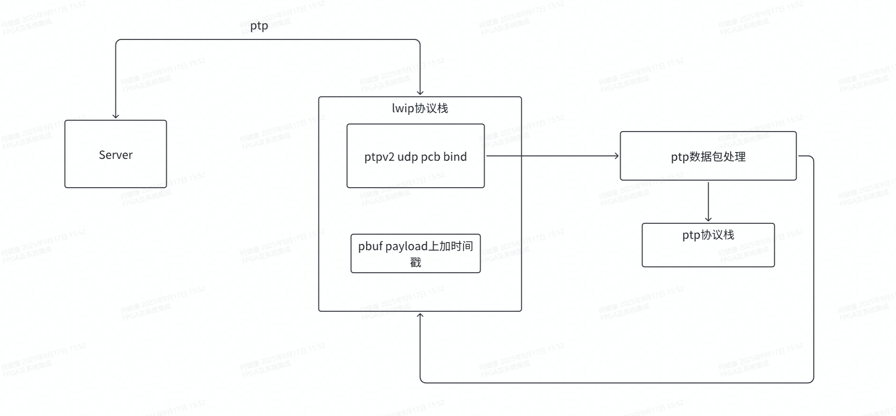
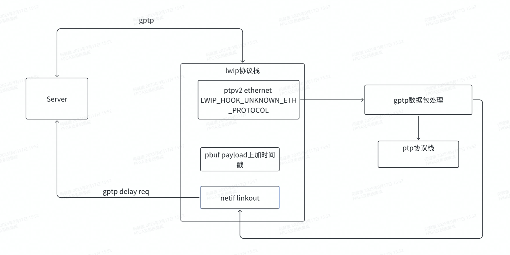

# lwip 支持 ptp和gptp功能记录

## 背景

xilinx的官方lwip bsp不支持 IEEE1588 协议

### ptp和gptp

ptp: 可以在普通网卡上以软件方式实现，但精度只能达到毫秒级。要达到微秒级，需要支持硬件时间戳的网卡，但协议本身并不强制
gPTP：强制要求链路上的每个设备（终端和交换机/网桥）都必须在硬件层面上支持时间戳。这意味着在数据包进入和离开网络端口的物理层瞬间，就由硬件打上时间戳，完全绕过了操作系统协议栈带来的随机延迟和抖动。这是实现纳秒级精度的基石。

## lwip协议栈修改

### ptp 和 gptp 架构

ptp实现

gptp实现

ptp(IEEE 1588)的基于udp的实现只需要绑定监听指定的端口(319, 320)上的事件就行
但是gptp协议是IEEE 802.1AS, 仅支持 Layer 2（以太网帧），所以需要去捕获以太网帧，这里在ethernet的input入口处捕获。需要特别注意需要设置mac的hash表，让gptp的多播地址不被mac过滤。xilinx的mac设置hash表的时候需要先stopmac，设置完后需要restart dma和start mac才能生效。
具体见我的项目[ptp-gptp-lwip移植代码仓库](https://github.com/Dereck-327/vitis_standalone_ptp)

### vitis中bsp源码替换方法

1. 以源文件的方式把需要修改的库文件夹添加到工程中
2. 新建bsp工程(没有弄成功)  
